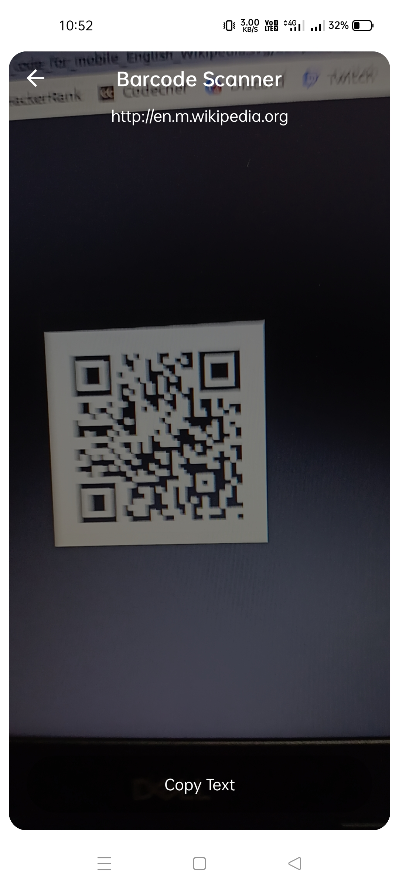
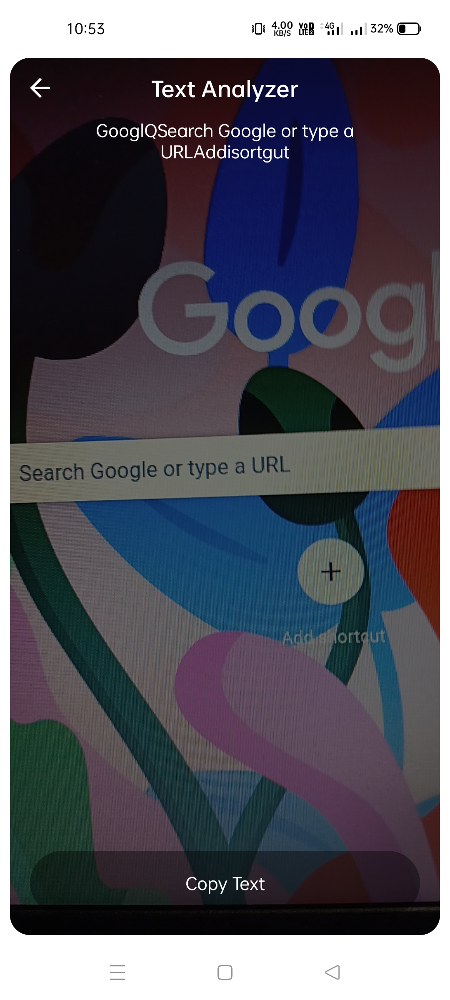
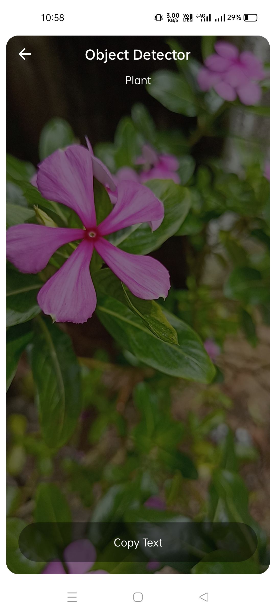

# MLKit-Analyzer
A simple application based on <a href = "https://developers.google.com/ml-kit">Google MLKit</a>

## Libraries Used
<li>Android Jetpack compose</li>
<li>Android Jetpack CameraX</li>
<li>Google MLKit</li>

## Samples

